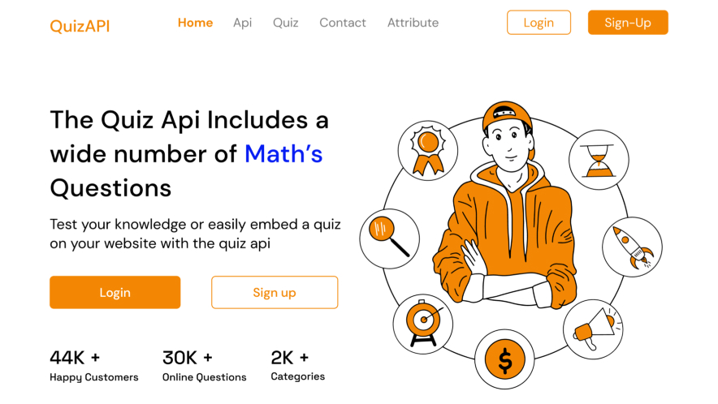

# 
QUIZBANK API

---

The largest Quiz Bank API featuring procedurally generated and user submitted questions.

Easily embed a quiz or create a practice test using our API. Question Provider. Solution Provider. Question Bank.

Proudly powered by PlanetScale database.

## 👀 Preview
To view, click this [link](https://quizzybank.vercel.app/)

## Blog Post
To know more about this project, you can read this [launch article]()

## Technologies Used:
- React
- Django, Django Rest Framework,
- Figma
- PlanetScale MYSQL serverless database

## Attribution
Built for [Hashnode](https://hasnode.com) x [PlanetScale](https://planetscale.com/) Hackathon

## Contributors
[Fayemi Boluwatife]() - Backend Developer

[John Adeyemi]() - Frontend Developer

[Godwin]()  - Frontend Developer

[Ogunniran Olamidotun]() - UI|UX designer

## 🔐 License
This project is licensed under [MIT License](LICENSE)
